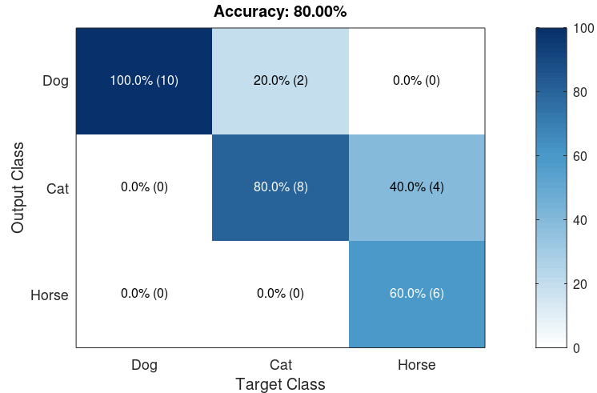

# plotConfMat

Plots a confusion matrix with colorscale, absolute numbers and precision
normalized percentages. This is a basic alternative to MATLAB's [plotconfusion]
if you do not have the Neural Network Toolbox. Compatible with GNU Octave.



Usage:

```matlab
plotConfMat(confmat, labels, fontsize, grayscale)
```

- `confmat` (required): confusion matrix
- `labels`: class labels (e.g. `{'Dog', 'Cat'}`) (default: `{'1', '2', ...}`)
- `fontsize`: to be used in plot texts (default: 14)
- `grayscale`:  if true, use grayscale colors (default is false - use blue
    colors like [scikit-learn])

[plotconfusion]: https://uk.mathworks.com/help/nnet/ref/plotconfusion.html
[scikit-learn]: https://scikit-learn.org/stable/auto_examples/model_selection/plot_confusion_matrix.html
